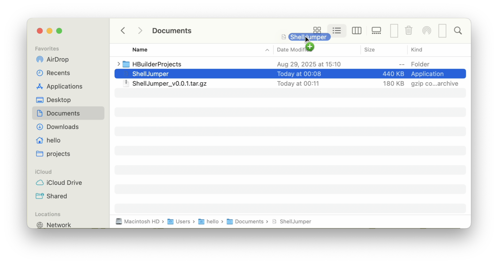

# ShellJumper
ShellJumper is a lightweight macOS utility that lets you open the current Finder folder in your favorite terminal or editor with a single click.

## Installation
1. Download the latest archive from the Releases section and extract it.
2. Hold `Command` and drag the app into the Finder toolbar.
   
3. Drop the `.app` bundle into the Applications folder to keep the toolbar shortcut available.

## Usage
Whenever you are browsing a folder in Finder, click the ShellJumper button in the toolbar. The tool launches your configured terminal (or editor) already set to the current directory.

## Roadmap
[ ] Allow choosing among different terminals for the active path (iTerm2, Warp, Ghostty, WezTerm, etc.).

[ ] Add quick actions to open the path in editors like Cursor, Zed, and VS Code.
